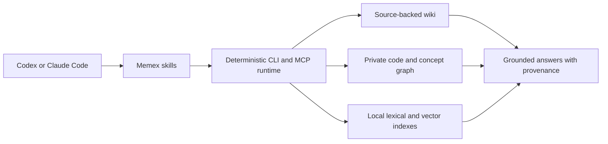

<p align="center">
  
</p>

<h1 align="center">Memex</h1>

<p align="center">
  <strong>Local-first, source-backed memory for coding agents.</strong><br>
  One source-backed wiki and private code graph, shared by Codex and Claude Code.
</p>

<p align="center">
  <a href="https://github.com/giulioleone097/memex/actions/workflows/ci.yml"></a>
  <a href="LICENSE"></a>
  <a href="plugins/memex/package.json"></a>
  
</p>

Memex turns a repository into durable, agent-readable memory. It builds a source-backed wiki, a private semantic code graph, and local retrieval indexes without sending repository content to another model or requiring a second API key.

The same deterministic runtime powers native plugin surfaces for both Codex and Claude Code.

## Why Memex

| Principle | What it means in practice |
| --- | --- |
| **Local first** | Wiki pages, graph data, and embeddings stay on your machine. |
| **Grounded by design** | Answers point back to page, file, Git, and line evidence. |
| **One memory, two hosts** | Codex and Claude Code use the same storage and runtime contracts. |
| **Graph-native** | Query symbols, dependencies, impact, paths, communities, and read-only Cypher. |
| **Operationally honest** | Doctor, status, provenance, redaction, retention, recovery, and purge are first-class. |

## Install in Codex

```bash
git clone https://github.com/giulioleone097/memex.git
cd memex

codex plugin marketplace add "$PWD" --json
codex plugin add memex@memex-local --json
codex plugin list --marketplace memex-local --json
```

Start a new Codex task so the installed skills and MCP server load into that task.

## Install in Claude Code

```bash
git clone https://github.com/giulioleone097/memex.git
cd memex

claude plugin validate --strict .
claude plugin marketplace add "$PWD" --scope user
claude plugin install memex@memex-local --scope user
claude plugin details memex@memex-local
```

Restart Claude Code after installation.

## Use it

Ask the host naturally, or invoke one of the focused workflows:

```text
Initialize a Memex for this repository.
Update this Memex from current repository evidence.
What depends on the authentication boundary, and why?
Show the shortest path from this API route to its persistence layer.
Diagnose the Memex and report anything stale or degraded.
```

| Workflow | Purpose |
| --- | --- |
| `memex` | Choose the right safe workflow for the request. |
| `memex-init` | Initialize repository or personal memory. |
| `memex-update` | Refresh only evidence affected by current changes. |
| `memex-query` | Answer from grounded wiki evidence without mutation. |
| `memex-graph` | Explore structure, context, impact, paths, and Cypher. |
| `memex-ingest` | Normalize authorized connector evidence as untrusted input. |
| `memex-ops` | Run doctor, schedules, recovery, privacy, and purge flows. |

## Architecture



Repository mode writes human-readable pages under `./memex/`. Private indexes live under `~/.memex/data/<workspace-id>/`; personal memory lives under `~/.memex/wiki/`. Graph construction reads bounded source, never executes repository code, and does not store source-file bodies in the graph.

## Build and prove it

```bash
npm --prefix plugins/memex ci
npm --prefix plugins/memex run build
npm --prefix plugins/memex run typecheck
npm --prefix plugins/memex run lint
npm --prefix plugins/memex test
```

Packaging validation, installed-cache proof, security boundaries, supported source kinds, graph grammar, migration, and operational details live in the [plugin handbook](plugins/memex/README.md).

## Project standards

- [Contributing](CONTRIBUTING.md)
- [Security](SECURITY.md)
- [Privacy](plugins/memex/PRIVACY.md)
- [Changelog](plugins/memex/CHANGELOG.md)
- [Origin and upstream attribution](plugins/memex/UPSTREAM.md)

Memex is released under the [MIT License](LICENSE).
